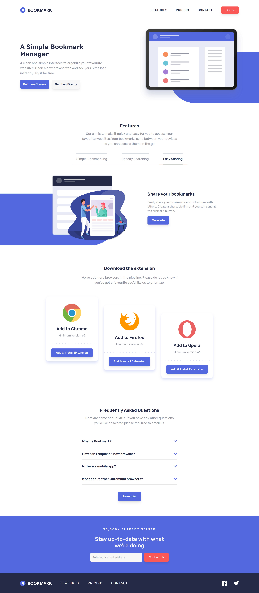
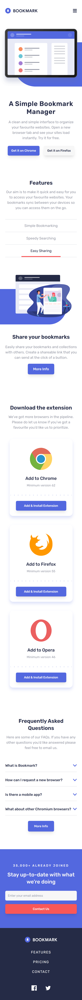

# Frontend Mentor - Bookmark landing page solution

This is a solution to the [Bookmark landing page challenge on Frontend Mentor](https://www.frontendmentor.io/challenges/bookmark-landing-page-5d0b588a9edda32581d29158). Frontend Mentor challenges help you improve your coding skills by building realistic projects.

## Table of contents

- [Overview](#overview)
  - [The challenge](#the-challenge)
  - [Screenshot](#screenshot)
  - [Links](#links)
- [My process](#my-process)
  - [Built with](#built-with)
  - [Continued development](#continued-development)
  - [Useful resources](#useful-resources)
- [Author](#author)
- [Acknowledgments](#acknowledgments)

## Overview

### The challenge

Users should be able to:

- View the optimal layout for the site depending on their device's screen size
- See hover states for all interactive elements on the page
- Receive an error message when the newsletter form is submitted if:
  - The input field is empty
  - The email address is not formatted correctly

### Screenshot

- Desktop version.  
  

- Mobile version.  
  

### Links

- Solution URL: [Github Repository](https://github.com/Abaljerind/bookmark-landing-page)
- Live Site URL: [Bookmark Landing Page](https://bookmark-landing-page-one-coral.vercel.app/)

## My process

### Built with

- Semantic HTML5 markup
- Flexbox
- CSS Grid
- Responsive Website
- Mobile-first workflow
- Prettier
- Git & Github
- [React](https://reactjs.org/) - JS library
- [Vite](https://vite.dev/) - React framework
- [TailwindCSS](https://tailwindcss.com/) - CSS framework

### Continued development

I would like to add animations for each part of this project like the  in Features component when users click another tab and then when user open this website for the first time I want to make it more attractive for the users.

### Useful resources

- [TailwindCSS](https://tailwindcss.com/) - This helped me to do the styling more easy. I really liked this tailwindcss and will use it going forward.
- [Vercel](https://vercel.com) - This is an amazing website which helped me to upload my website into the internet. I'd recommend it to anyone still learning to use this website.

## Author

- My Portfolio - [@Abaljerind](https://portofolio-jerind.vercel.app/)
- Github - [@Abaljerind](https://github.com/Abaljerind)
- LinkedIn - [@Abaljerind](https://www.linkedin.com/in/abal-jerind-baa90519a/)

## Acknowledgments

I want to thank me for believing in me, I want to thank me for doing all this hard work. I wanna thank me for having no days off. I wanna thank me for never quitting. I wanna thank me for being me at all times.
